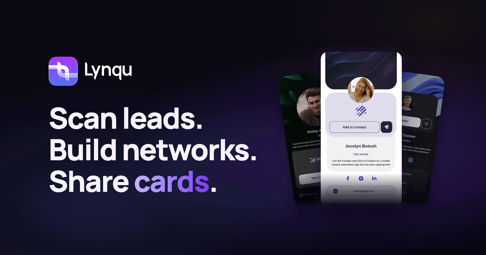

<div align="center">



# Lynqu AI Toolkit

**Operate your entire lead motion — research → capture → manage → follow up → measure — straight from Claude, ChatGPT, or Cursor.**

Open-source [Claude Skills](https://docs.claude.com/en/docs/agents-and-tools/agent-skills) + [MCP](https://modelcontextprotocol.io) for AI lead capture, lead research, sales follow-up, and pipeline management — powered by [Lynqu](https://lynqu.com).

[](LICENSE)
[](skills)
[](docs/mcp/tool-catalog.md)
[](https://modelcontextprotocol.io)

<br/>

[](https://lynqu.com/contact-sales)
&nbsp;
[](https://lynqu.com)

</div>

---

## ✨ What this does

Connect Lynqu to your AI assistant, then run your sales motion in plain language. No dashboards, no data entry, no context-switching.

```text
You ▸ I met ~30 people at the SaaStr booth. Here's the list [paste].
      Dedupe against our contacts, add the new ones to the Events pipeline,
      tag them SaaStr-2026, and draft follow-ups for the hot ones.

Lynqu AI ▸ Working through it…
   🔎  Checked 30 contacts → 22 new, 8 already in your pipeline (skipped)
   ➕  Created 22 leads in "Events" at the New stage
   🏷️  Tagged SaaStr-2026 · attached to the SaaStr campaign
   🔥  6 flagged hot (asked for a demo) — drafts ready below for your review
   ✅  Done. Want me to send the 6 follow-ups, or tweak them first?
```

That whole flow is one sentence to you — and a chain of audited Lynqu actions under the hood. **The skill is the recipe; the MCP is the hands.**

---

## ⚡ Quick start

**1. Connect the Lynqu MCP server** (OAuth — no API key to copy):

| Server | URL | Scope |
| --- | --- | --- |
| **Organization (B2B)** | `https://api.lynqu.com/mcp/v2` | Cards, contacts, leads, campaigns, events, pipeline, team, follow-ups, AI employees, analytics |
| **Personal** | `https://api.lynqu.com/mcp/me` | Your own cards, card analytics, profile |

Paste the URL into your client's connector settings, sign in, approve. Full per-client steps → [`docs/mcp/connect.md`](docs/mcp/connect.md). There's also a one-click setup in the Lynqu app under **Settings → AI / MCP**.

**2. Install the skills** — the method depends on where you use Claude:

<details open>
<summary><b>Claude Code</b> (copy the folders)</summary>

```bash
git clone https://github.com/Gravisun/lynqu-ai-toolkit.git
cp -r lynqu-ai-toolkit/skills/lynqu* ~/.claude/skills/
```
</details>

<details>
<summary><b>claude.ai — web, desktop app &amp; mobile</b> (upload one ZIP per skill)</summary>

`~/.claude/skills` is Claude Code only; everywhere else — including the Claude desktop app — each skill is uploaded as its own ZIP. Needs a Pro, Max, Team or Enterprise plan.

1. Turn on **Settings → Capabilities → Code execution and file creation** (without it the Skills section does nothing).
2. Grab the ready-made ZIPs from the [latest release](https://github.com/Gravisun/lynqu-ai-toolkit/releases/latest) — or build them yourself. The skill folder must be the root of the archive, not the loose files and not a wrapper directory:

   ```bash
   git clone https://github.com/Gravisun/lynqu-ai-toolkit.git
   cd lynqu-ai-toolkit/skills
   for s in lynqu*; do zip -r "../$s.zip" "$s"; done
   ```
3. **Settings → Customize → Skills → Add** and upload the ZIPs one at a time.
</details>

> ⚠️ Writing your own skill? Keep `description` under **200 characters**. Anthropic's documented ceiling is 1024, but the description sits in context permanently and is the text Claude matches your request against — short and specific triggers better, and uploads cleanly on every surface. `python3 scripts/validate_skills.py` enforces it.

**3. Just ask:**

> *"Research 10 fintech targets in London, qualify them for Lynqu, and create leads for the best fits."*

That's it. See [`examples/prompts.md`](examples/prompts.md) for a full prompt library.

> 💡 **Plan note:** connecting is free on any account. *Running* tools needs an AI-tier plan (Pro+AI, Business+AI or Enterprise).

---

## 🛠️ The skills

Seventeen skills covering the whole motion. **You don't need to learn them.** Say
what's going on and [`lynqu`](skills/lynqu) works out which ones to run, in what
order.

```
/lynqu we just got back from SaaStr with 200 badges and I don't know where anything is
```
> Routes to `event` → `capture` → `qualify` → `outreach`, confirming before each write.

Or drive them directly:

| Command | Skill | What lands in Lynqu |
| --- | --- | --- |
| `/lynqu` *(anything)* | 🧭 [`lynqu`](skills/lynqu) | Composes the right skills for the situation |
| `/lynqu prospect` | 🔬 [`lynqu-prospect`](skills/lynqu-prospect) | Full account audit → lead, company, score, notes, first task |
| `/lynqu research` | 🔎 [`lynqu-lead-research`](skills/lynqu-lead-research) | Ranked target list → leads with the fit rationale attached |
| `/lynqu qualify` | ✅ [`lynqu-qualify`](skills/lynqu-qualify) | BANT + MEDDIC → score, temperature, stage, a task per gap |
| `/lynqu contacts` | 👥 [`lynqu-contacts`](skills/lynqu-contacts) | Buying committee → contacts, participants, one primary |
| `/lynqu icp` | 🎯 [`lynqu-icp`](skills/lynqu-icp) | ICP mined from your own wins **and losses** → scoring rules |
| `/lynqu competitors` | ⚔️ [`lynqu-competitors`](skills/lynqu-competitors) | Battlecard → objections and honest answers, saved to the lead |
| `/lynqu capture` | ➕ [`lynqu-lead-capture`](skills/lynqu-lead-capture) | Badges and pasted lists → **deduped**, routed, tagged leads |
| `/lynqu outreach` | 📤 [`lynqu-outreach`](skills/lynqu-outreach) | First-touch sequence → template, sent only on your yes |
| `/lynqu followup` | ✉️ [`lynqu-sales-followup`](skills/lynqu-sales-followup) | Post-meeting and re-engagement → sends from the template that gets replies, plus scheduled next steps |
| `/lynqu prep` | 📋 [`lynqu-prep`](skills/lynqu-prep) | Meeting brief → agenda, open threads, the questions that matter |
| `/lynqu proposal` | 🧾 [`lynqu-deal-desk`](skills/lynqu-deal-desk) | Priced line items → a **draft** quote; you stay the one who sends |
| `/lynqu playbook` | 📕 [`lynqu-sales-playbook`](skills/lynqu-sales-playbook) | A written playbook → leads, dated tasks, the doc on the lead, stage rules that deliver the prep |
| `/lynqu event` | 🎪 [`lynqu-event-blitz`](skills/lynqu-event-blitz) | Event + campaign → capture → attribution → ROI you can answer |
| `/lynqu pipeline` | 🗂️ [`lynqu-lead-management`](skills/lynqu-lead-management) | Stage moves, owners, merges, clean-up, stalled sweep |
| `/lynqu report` | 📊 [`lynqu-pipeline-report`](skills/lynqu-pipeline-report) | Weekly briefing: movement, risk, ROI, which emails get replies. **Read-only** |
| `/lynqu card` | 🪪 [`lynqu-card-studio`](skills/lynqu-card-studio) | Cards created, updated, and read for engagement |

Every skill ends by **writing to Lynqu** — a scored lead, a dated task, a note
the next rep inherits. A brief nobody acts on is a document; a lead in the right
stage with a next step is a pipeline.

---

## 🧠 How it works

```text
 You (plain language)
      │
      ▼
 ┌──────────────────────┐     loads the recipe
 │   AI assistant       │ ◄───────────────────────  Lynqu Agent Skill  (this repo)
 │ (Claude / ChatGPT /  │                            • which tools to call
 │  Cursor)             │                            • in what order
 └──────────┬───────────┘                            • the guardrails
            │ calls MCP tools
            ▼
 ┌──────────────────────┐     OAuth 2.1 (no keys)
 │  Lynqu MCP server    │ ◄───────────────────────  https://api.lynqu.com/mcp/v2
 └──────────┬───────────┘
            ▼
 ┌──────────────────────────────────────────────────────────────┐
 │  Your Lynqu workspace                                          │
 │  cards · contacts · leads · campaigns · events · pipeline      │
 └──────────────────────────────────────────────────────────────┘
```

A typical multi-step ask fans out like this:

```text
"Research fintech targets, create leads, set them up, and draft intros"

  Phase 1 ▸ RESEARCH      lynqu-lead-research   → score & shortlist accounts
  Phase 2 ▸ CREATE        create-lead × N       → leads land in the pipeline
  Phase 3 ▸ ORGANIZE      lynqu-lead-management  → stage, owner, tags
  Phase 4 ▸ OUTREACH      lynqu-sales-followup   → drafts for your approval
```

You stay in control: skills **confirm before writing in bulk** and **always ask before sending email**. Deletes, merges and AI employee approvals each get their own yes, one record at a time.

---

## 🔁 Follow-ups, replies and AI employees

Lynqu closes the engagement loop, and the MCP reaches every part of it:

- **Personal follow-ups.** Every rep can save their own version of a team
  template or sequence. It replaces the team text on their own leads, unless an
  admin locked it.
- **Follow-up performance.** Sent, delivered, opened, clicked, replied, booked
  and won, by template, sequence step, rep or AI employee. Reply rate is the
  headline, and nothing is ranked on fewer than 20 delivered emails.
- **Replies.** With reply tracking on, a human reply stops the lead's automated
  follow-ups, lands on its timeline and in the outbox, and is forwarded to
  whoever the email went out as.
- **AI employees.** Read what an agent did and why, see the work it handed back,
  and approve or reject its parked actions one at a time. Agents write from the
  org's confirmed sales brief.

How these fit together: [`docs/concepts.md`](docs/concepts.md).

---

## 💬 Examples

**Lead research → pipeline**
> *"Build a list of 10 mid-market SaaS companies in DACH attending SaaStr Europe, find a VP Sales or RevOps lead at each, score them for Lynqu, and create leads for anything 7+."*
```text
🔎 Researched 14 → shortlisted 10 · scored on ICP fit + buying signal
   ⭐ 9/10  Northwind Cloud — hiring 4 AEs, VP Sales identified
   ⭐ 8/10  Veridian Pay — Series B last month, RevOps lead identified
   …
➕ Created 7 leads (score ≥ 7) · 3 held for your review (4–6)
```

**Post-event follow-up**
> *"Draft post-event follow-ups for everyone tagged SaaStr-2026 in the Warm stage using the 'Event recap' template, personalize from each lead's notes, show me the drafts, then send after I approve."*
```text
✉️ 12 drafts ready — personalized from each lead's timeline
   (no "we met yesterday" phrasing — stale by send time)
⏸️ Awaiting your approval before anything sends
```

**Monday pipeline review**
> *"Give me this week's pipeline report for Inbound: what moved, what's stalled 14+ days, how the Q2 campaign tracks to goal, and the top 5 things I should do."*
```text
📊 Net pipeline +18% WoW · 6 leads advanced · 2 won
🔥 4 deals stalled 14+ days in Demo → flagged for follow-up
🎯 Q2 campaign: 62% to goal, pacing ahead
✅ Top 5 actions listed — want me to action #1–3 now?
```

More in [`examples/prompts.md`](examples/prompts.md).

---

## 📈 What it does for your sales team

Lynqu runs the full arc — **capture → engage → manage → measure** — and this toolkit makes every step conversational. Less admin, faster follow-up, cleaner data, real attribution.

<table>
<tr>
<td width="33%" valign="top">

### 🧑‍💼 Field rep
*"Summarize every card I scanned today and draft intros."*

Walk out of an event with leads already captured, deduped, tagged, and follow-ups drafted — before you reach the parking lot.

</td>
<td width="33%" valign="top">

### 📊 Sales ops
*"How's the pipeline, and what's stalling?"*

Natural-language pipeline queries, bulk hygiene, owner routing, and weekly reports — without building a single custom dashboard.

</td>
<td width="33%" valign="top">

### 🚀 Founder / SMB team
*"Find 10 prospects and set them up."*

A repeatable research → capture → outreach motion that runs in minutes, so a small team punches above its weight.

</td>
</tr>
</table>

---

## 📂 Repository layout

```text
lynqu-ai-toolkit/
├── docs/
│   ├── concepts.md              # The Lynqu model: cards, leads, pipeline, follow-ups, AI employees
│   ├── mcp/
│   │   ├── connect.md           # Connect each client (Claude · ChatGPT · Cursor · VS Code)
│   │   ├── authentication.md    # OAuth 2.1 flow + plan tiers, explained
│   │   ├── tool-catalog.md      # All 163 org tools + 10 personal tools, by category
│   │   └── troubleshooting.md   # Common connection errors and fixes
│   └── client-configs/          # Copy-paste config snippets per client
├── skills/                      # The 17 Lynqu Agent Skills
├── examples/prompts.md          # Prompt library
├── examples/playbooks/          # Worked playbook doc set (fictional)
└── scripts/validate_skills.py   # Frontmatter + tool-reference validator (runs in CI)
```

---

## ✅ Requirements

- A [Lynqu](https://lynqu.com) account (free to connect; AI-tier plan to run tools).
- An MCP client that supports remote (streamable HTTP) servers with OAuth — **Claude** (Desktop, Code, claude.ai), **ChatGPT**, **Cursor**, **VS Code (Copilot)**, and others.
- The skills are most fully featured in Claude; the MCP works with any compliant client.

---

## 🔎 Looking for…

- **I don't want to learn commands** → [`lynqu`](skills/lynqu) — describe the situation, it composes the rest
- **A Claude skill for lead capture** → [`lynqu-lead-capture`](skills/lynqu-lead-capture)
- **AI lead research / lead generation with Claude** → [`lynqu-lead-research`](skills/lynqu-lead-research)
- **Prospect research / account audit with Claude** → [`lynqu-prospect`](skills/lynqu-prospect)
- **BANT / MEDDIC lead qualification** → [`lynqu-qualify`](skills/lynqu-qualify)
- **Finding the decision maker / buying committee** → [`lynqu-contacts`](skills/lynqu-contacts)
- **Building an ICP from your own win/loss data** → [`lynqu-icp`](skills/lynqu-icp)
- **Competitive battlecards & objection handling** → [`lynqu-competitors`](skills/lynqu-competitors)
- **Cold outreach sequences** → [`lynqu-outreach`](skills/lynqu-outreach)
- **A sales follow-up automation skill** → [`lynqu-sales-followup`](skills/lynqu-sales-followup)
- **Meeting preparation briefs** → [`lynqu-prep`](skills/lynqu-prep)
- **Turning a sales playbook into a working pipeline** → [`lynqu-sales-playbook`](skills/lynqu-sales-playbook)
- **Quotes & price-book proposals** → [`lynqu-deal-desk`](skills/lynqu-deal-desk)
- **Event / trade-show lead capture** → [`lynqu-event-blitz`](skills/lynqu-event-blitz)
- **Connect Lynqu MCP to ChatGPT / Cursor / Claude** → [`docs/mcp/connect.md`](docs/mcp/connect.md)
- **Which follow-up template gets replies** → [`lynqu-pipeline-report`](skills/lynqu-pipeline-report)
- **The full Lynqu MCP tool reference** → [`docs/mcp/tool-catalog.md`](docs/mcp/tool-catalog.md)

---

## 🤝 Contributing

Issues and PRs welcome — see [`CONTRIBUTING.md`](CONTRIBUTING.md). New skills must call only documented MCP tools and ship with a prompt example. CI validates skill frontmatter and tool references on every PR.

## 📄 License

[MIT](LICENSE) © [Gravisun](https://github.com/Gravisun). "Lynqu" is a trademark of Gravisun; this license covers the code and docs in this repository, not the Lynqu brand or hosted service.

---

<div align="center">
<sub>Built for <a href="https://lynqu.com">Lynqu</a> — Networking Evolved. &nbsp;·&nbsp; <a href="https://lynqu.com/contact-sales">Book a Demo</a> &nbsp;·&nbsp; Get the app on <a href="https://lynqu.com">iOS &amp; Android</a></sub>
</div>
